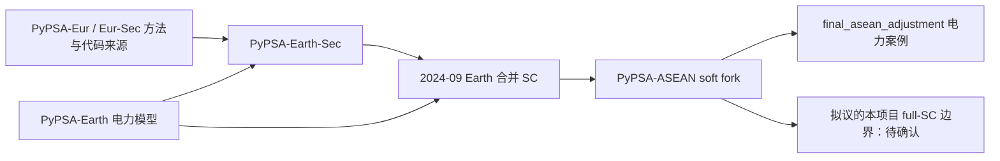

# 部门耦合来源与边界追踪

**PyPSA-ASEAN 的部门耦合主体继承自 PyPSA-Earth，而 Earth 在 2024 年合并了 PyPSA-Earth-Sec。ASEAN 论文在此框架上进行了电力案例裁剪及区域数据调整。完整框架的继承关系已经恢复，完整 ASEAN 部门耦合基准并未因此获得验证。**

## 可复核的代码血缘

箭头表示继承/依赖，不表示各模型数据、配置或科学问题相同。

| 层 | 直接证据 | 可以得出的结论 |
|---|---|---|
| PyPSA-Earth-Sec 独立项目 | 官方 README 明示建于 PyPSA-Earth，并曾通过 submodule 依赖它 | 早期 SC 为独立层，不是 ASEAN 为本论文从头编写 |
| SC 早期代码 | 本地 `--follow` 历史最早追至 `42f4a1b3110a35dc7b82614ac28dbdb93d155b01`（2022-02-09）；随后 CO₂/H₂、industry 等提交 | 可追踪已有 SC 脚本历史，而不是只有当前源码快照 |
| 合并入 Earth | `a8987468ceda152ed1152f6c7bfa2ffb79da0837`（2024-09-19），PR #1086，merge-pyspa-earth-sec | 工业需求、热、交通、气体网络、sector network、brownfield 等进入统一 Earth 工作流 |
| ASEAN 区域层 | 官方仓库 fork 信息、ASEAN 特有 transmission_projects / append_cost_data / final_asean_adjustment / subregion 配置 | 区域网络、AEO8 成本和电力需求分配等为 ASEAN 定制层 |
| 更早的 Eur/Eur-Sec 来源 | SPDX 作者声明；早期函数内有来自 pypsa-eur 的标注；历史中 EU carrier/global 假设逐步泛化 | 支持方法/代码复用关系；本轮未逐函数恢复每个 Eur/Eur-Sec 原始 SHA，不能把整个 SC 模块归于一个未经核实的 Eur commit |

来源：[Earth 合并 PR #1086](https://github.com/pypsa-meets-earth/pypsa-earth/pull/1086)、[Earth-Sec 仓库](https://github.com/pypsa-meets-earth/pypsa-earth-sec)、[ASEAN 论文运行树](https://github.com/pypsa-meets-earth/pypsa-asean/tree/5bacad702ccfed17ad19ab510fa710651e966f2c)。原始响应/历史保存在 `official/earth_merge1086.json`、`official/earthsec_readme.md`、`history/sector_origin.txt`、`history/sector_module_history.txt`。

## 必须分别命名的四层

| 层 | 范围与证据 | 不能据此声称 |
|---|---|---|
| framework capability | prepare_sector_network 支持热、H₂、行业、交通、航运航空、农业、住户与服务等载能转换 | 所有地区的原始需求/设施/资源数据都完整 |
| current repo config | ce327bfa 的 ASEAN sector 开关多项 true；最后 only_elec_network=true；H₂/CO₂ 网络关闭 | 默认最终网络就是 full-SC |
| tutorial config/result | 50 clusters、六天、3h、2030/2040/2050；land_transport=false；最终工业电力为零 | paper reproduction 或有效 full-SC baseline |
| published paper config/result | 5bacad70 metadata：100 clusters、全年 3h、六个规划年、land_transport=true、only_elec_network=true；两样本有非零工业电力 | 全部非电部门均已在论文研究与验证 |

论文正文§3.1与后续工作部分、作者配置、最终组件三类证据一致指向“电力案例”。多部门电力 Load 和 EV 灵活性仍可能保留；不能把它简化成没有任何部门技术的纯电负荷模型，也不能反向称为完整多能源系统。

## 主要逻辑所属层与数据链

| 模块 | 上游逻辑 / ASEAN 特化 | 当前及 full-SC 审计含义 |
|---|---|---|
| 电力网络、可再生资源、地理聚类 | Earth 电力层；ASEAN prebuilt/AIMS/NDP/岛屿子区调整 | 基准地理与跨境边界要冻结；不能用删除所有 Link 代表断开国家互联 |
| H₂ | Earth-Sec→Earth 的 add_hydrogen；电解/燃料电池/Store/气体改造等 | H₂技术存在与 H₂network 开启是两回事；当前网络开关 false |
| 热 | add_heat、COP/热需求/锅炉/热泵/热储能 | 全球需求和建筑参数需要 ASEAN 适用性确认；最终电力裁剪会移除大量热结构 |
| 工业 | UNSD→base_industry_totals→设施/GDP key→industry demand→add_industry | 本轮定位 GDP 缓存失配；设施缺口、DEFAULT CAGR 和工艺假设另需确认 |
| 交通 | EV/充电与交通燃料、铁路、航运航空的上游实现 | 论文有 EV Load；教程关闭陆路交通；非电燃料服务并不等于论文已覆盖 |
| 农业、住户、服务 | 上游 energy totals 及 add_* 函数 | 数据表中的 global/default 不能默认为 ASEAN 确认数据；裁剪 carrier 名称需复核 |
| CO₂记账/捕集/封存 | Earth-Sec/Earth 多端 Link、atmosphere/store、全局约束 | 论文电力年度预算不能自动覆盖 full-SC；共享储存/资源边界影响 standalone |
| 现有能力与时序 | 上游 add_existing_baseyear / add_brownfield 与 myopic | 不是每期完全独立的绿地模型；国家实验需保持资产和寿命可比 |
| 成本 | PyPSA technology-data、DEA/其他源；ASEAN AEO8 append | 成本函数不代表底层数值已确认；见 DEA_COST_SOURCE_TRACE |
| 最终电力化处理 | ASEAN `final_asean_adjustment.py`（2025-10 引入） | 位于 sector network 构建之后、正式求解之前，是框架能力与最终案例的关键分界 |

## 当前 main 比论文运行版本多出的变化

历史中可见 2026-06 显式 ammonia 行业（`d3e21b08…`）、2026-07 GIS 地下 H₂/氢轮机相关改动（`fffa25e6…`）、2026-08 demand/h2export wildcard 移除（`aab88924…`）、ASEAN DemandCast 接入（`5557557b…`）以及 2026-09 固定部门排放表达变化（`725d65b0…`）。这些是版本差异线索，不是本项目加入新技术的授权。

因此 full-SC 项目必须明确选择哪一个模型基线，并逐项说明相对论文运行版本的差异。直接取消 only_elec_network 并沿用当前全套开关，会同时改变需求、转换技术、碳边界和资产结构；这不是已经定义好的互联实验。

## 对互联研究的约束

在 full-SC 边界成立后，跨国电力连接可通过电解、热泵、电锅炉、EV、工业电气化、储能和燃料替代改变系统成本与各国投资。这是物理/优化结构推断，尚无本项目正式求解验证。

需共同决定关闭哪些跨境载能网络，保留哪些外部商品供应、国内输电、共享生物质/碳池及资源份额。现有 fuel Generator 是模型边界上的供给，不自动具有“进口国/出口国”的统计身份。关闭跨国 AC/DC 也不保证其他共享 Bus/Store/全球约束已解除国家协同。

结论：血缘可追溯；**full-SC boundary 尚不能冻结**。应先形成具名的载能/需求/资源边界表，并在独立工程任务中验证工业映射、需求守恒、碳兼容及上轮拓扑疑点，然后才形成可执行实验方案。
